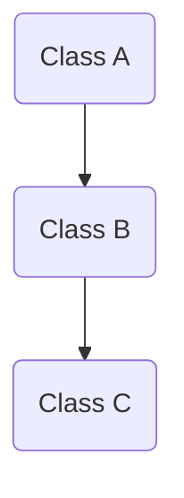
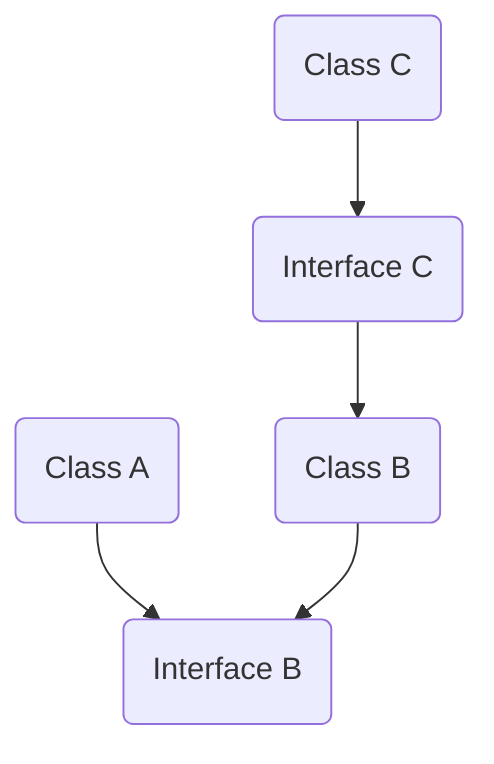

# 依赖注入

开发时的指导原则是关注点分离。这一原则主张，软件应该根据它所执行的工作类型进行分离。例如，考虑一个应用程序，该应用程序包含用于识别要显示给用户的值得注意的项的逻辑，以及以特定方式格式化这些项以使它们更明显的逻辑。负责选择要格式化哪些项的行为应该与负责格式化项的行为分开，因为这些行为是相互独立的关注点，只是巧合地相互关联。

## 依赖倒置

为什么会有依赖注入，那就不得不提设计模式里设计原则 [SOLID](https://zh.wikipedia.org/wiki/SOLID_(%E9%9D%A2%E5%90%91%E5%AF%B9%E8%B1%A1%E8%AE%BE%E8%AE%A1)) 之一依赖倒置(Dependency Inversion Principle)。

> 原始定义：High level modules should not depend upon low level modules. Both should depend upon abstractions. Abstractions should not depend upon details. Details should depend upon abstractions。

> 官方翻译：高层模块不应该依赖低层模块，两者都应该依赖其抽象；抽象不应该依赖细节，细节应该依赖抽象。

应用程序中依赖关系的方向应该是抽象的方向，而不是实现细节的方向。大多数应用程序都是这样编写的：

编译时依赖关系沿着运行时执行的方向流动，从而产生直接的依赖关系图。

运行时：类 A 调用类 B 的方法，类 B 调用类 C 的方法



编译时：类 A 依赖于类 B，类 B 依赖于类 C


应用依赖倒置原则允许 A 在 B 实现的抽象上调用方法，使得 A 可以在运行时调用 B，但 B 可以在编译时依赖于 A 控制的接口（因此，反转标准编译时依赖关系）。在运行时，程序执行的流程保持不变，但是接口的引入意味着可以很容易地插入这些接口的不同实现。

编译时：类 A 依赖于接口 B，类 B 实现接口 B，类 B 依赖于接口 C，类 C 实现接口 C



编译时：类 A 依赖于类 B，类 B 依赖于类 C


依赖倒置原则是面向对象设计中的一个重要原则，它有助于开发出松耦合、可复用的代码。在实际编程中，我们可以通过依赖注入（Dependency Injection）来实现依赖倒置原则。具体来说，就是通过抽象来实现模块之间的松耦合，而实现这个抽象的方法就是依赖注入。在依赖注入中，我们通过把依赖关系从代码中抽离出来，然后通过外部容器来管理这些依赖关系，从而实现模块之间的松耦合。

## 依赖注入

在说依赖注入之前不得不说控制反转，依赖注入（Dependency Injection，简称 DI）和控制反转（Inversion of Control，简称 IoC）是软件开发中两个相关但经常被误用的术语。

### 控制正转

有控制反转那么是否有控制正转，答案是肯定的。

控制正转是与控制反转相对的一个概念。在控制正转中，应用程序的控制权由程序员手动控制，而不是像控制反转一样由容器进行管理和控制。

在控制正转中，程序员需要管理对象的创建、依赖关系和生命周期。这意味着程序员必须手动创建对象、处理依赖关系并调用各个对象的方法。虽然这种方式相对简单，但在应用程序变得更加复杂时，将会变得非常麻烦和难以维护。

以下是一个使用控制正转的示例代码，演示了如何手动创建对象并处理对象之间的依赖关系：

```ts
interface Engine {
   start: () => void;
}

class Car {
   constructor(private engine: Engine) {}

   public start(): void {
      engine.start();
      console.log("Car started");
   }
}

class GasolineEngine implements Engine {
   public start(): void {
      console.log("Gasoline engine started");
   }
}

class Driver {
   public drive(): void {
      const engine = new GasolineEngine();
      const car = new Car(engine);
      car.start();
   }
}
```

在以上示例代码中，我们可以看到程序员手动创建了 `GasolineEngine` 和 `Car` 的实例，并将 `Engine` 对象注入到 `Car` 对象中。`Driver` 对象内部使用 `Car` 和 `Engine` 对象来驱动汽车，并使用 `GasolineEngine` 作为发动机。程序员需要手动维护所有对象之间的依赖关系和生命周期。

虽然这样的示例代码可以很好地工作，但随着应用程序变得更加复杂，这种方式将会变得非常困难和难以维护。因此，接下来我们使用控制反转容器和依赖注入技术怎么使应用程序变得更加灵活和可扩展。

### 控制反转

控制反转（Inversion of Control，IoC）是一种软件设计模式，它是一种将应用程序的控制权从一个模块转移到另一个模块的方式。

传统的应用程序一般都是由程序员编写并调用的。在这种情况下，程序员必须管理对象的生命周期、解决对象之间的依赖关系并调用各种方法。如果应用程序变得更加复杂，这种方式就会变得非常困难。而控制反转模式可以帮助我们解决这个问题。

控制反转模式的核心思想是将应用程序的控制权从程序员手中解放出来，转交给 `IoC` 容器（也叫控制反转容器）。`IoC` 容器负责管理对象的生命周期和依赖关系，并且自动调用各个对象中的方法。在这个过程中，程序员只需要配置 `IoC` 容器，告诉容器对象之间的依赖关系、实例化方式等信息，然后由容器进行实例化和管理。

控制反转常常与依赖注入（Dependency Injection，DI）一起使用。依赖注入是 `IoC` 的一种具体实现方式，它通过构造函数、属性或方法等方式，将依赖的对象注入到需要依赖的对象中，从而实现对依赖对象的控制反转。使用依赖注入之后，一个对象不需要自己去创建或管理自己所需要的对象，而是交由 `IoC` 容器管理，从而实现了应用程序的解耦和灵活性。

以下是一个使用控制反转容器和依赖注入的示例代码：

```ts
interface Engine {
   start: () => void;
}

class Car {
   constructor(private engine: Engine) {}

   public start(): void {
      engine.start();
      console.log("Car started");
   }
}

class GasolineEngine implements Engine {
   public start(): void {
      console.log("Gasoline engine started");
   }
}

class Driver {
   constructor(private car: Car) {}

   public drive(): void {
      car.start();
   }
}

// Inversion of Control container
class CarContainer {
   public static main() {
      const engine = new GasolineEngine();
      const car = new Car(engine);
      const driver = new Driver(car);
      driver.drive();
   }
}
```

在以上示例代码中，我们可以看到程序员不再手动创建对象或处理对象之间的依赖关系。相反，我们使用一个控制反转容器（即 `CarContainer`类）来创建和管理 `Engine` 和 `Car` 对象，并将其注入到 `Driver` 对象中。在 `CarContainer` 类中，我们创建了一个`GasolineEngine` 实例和一个 `Car` 实例，并将其注入到一个 `Driver` 实例中。在 `Driver` 对象中，我们可以直接使用 `Car` 对象来驱动汽车。

通过使用控制反转容器和依赖注入来实现了应用程序的解耦和灵活性。程序员不再需要手动创建对象或处理对象之间的依赖关系，因为这些工作都交由 `IoC` 容器处理。

相对于控制正转，`IoC` 容器和依赖注入技术使应用程序变得更加灵活和可扩展，因为它们可以自动地管理对象之间的依赖关系和生命周期，并自动调用各个对象的方法。但同时，也需要消耗更多的计算资源和内存空间，因为 `IoC` 容器需要额外的代码来管理对象。

综上所述，控制正转和控制反转都有各自的优缺点，程序员可以选择根据具体应用场景来决定使用哪种方式。

### 依赖注入

依赖注入（Dependency Injection，DI）是一种设计模式，用于实现松散耦合（loosely coupled）的软件组件之间的依赖关系。通常来说，`DI` 的核心思想是：组件不再负责创建和管理它所依赖的对象，而是通过外部的容器，在运行时将其所需的依赖项注入进来。

在依赖注入的应用中，容器负责管理依赖关系。组件不需要知道依赖项的具体实现细节，只需要声明依赖项的接口或抽象类。在运行时，容器会判断这些接口或抽象类的实现类，并自动注入到组件的属性或构造函数中。

理解 `DI` 的关键是：“谁依赖谁，为什么需要依赖，谁注入谁，注入了什么”，那我们来深入分析一下：

- 谁依赖于谁：当然是某个容器管理对象依赖于 `IOC` 容器；“被注入对象的对象”依赖于“依赖对象”；
- 为什么需要依赖：容器管理对象需要 `IOC` 容器来提供对象需要的外部资源；
- 谁注入谁：很明显是 `IOC` 容器注入某个对象，也就是注入“依赖对象”；
- 注入了什么：就是注入某个对象所需要的外部资源（包括对象、资源、常量数据）。

依赖注入用于减少代码之间的耦合性。在依赖注入中，类不会自行创建和管理它所依赖的对象，而是将依赖关系交由外部的注入器来管理。这样，当需要更改依赖关系时，只需要更改注入器中的配置信息，而不需要修改类本身的代码。

依赖注入通常有三种方式实现：

- 构造函数注入：通过在类的构造函数中接收依赖对象的实例来实现注入。
- 属性注入：通过在类中定义一个公共属性，并在注入器中设置相应的依赖来实现注入。
- 方法注入：通过在类中定义一个公共方法，并在注入器中设置相应的依赖来实现注入。

依赖注入可以简化代码的编写和维护，增加代码的灵活性和可测试性，以及提高代码的可读性和可维护性。它在很多大型和复杂的应用程序中得到了广泛的应用。

```ts
interface Engine {
   start: () => void;
}

@Injectable()
class Car {
   constructor(private engine: Engine) {}

   public start(): void {
      engine.start();
      console.log("Car started");
   }
}

class GasolineEngine implements Engine {
   public start(): void {
      console.log("Gasoline engine started");
   }
}

@Injectable()
class Driver {
   constructor(private car: Car) {}

   public drive(): void {
      car.start();
   }
}

// Inversion of Control container
class CarContainer {
   public static main(driver: Driver) {
        const container = new Container();
        const driver = container.get(Driver)
        driver.drive();
   }
}
```

在以上示例代码中，我们可以看到整体和控制反转代码差不多，唯一区别是使用 `@Injectable()` 装饰器进行注入依赖，通过实例化 `Container` 获取 `Driver` 并进行调用 `drive()`。为什么 `driver` 不需要实例化？在 `Container` 内部已经帮我们处理，因为它需要处理被注入对象的对象的依赖关系。

依赖注入的好处：

1. 降低了代码的耦合性，使得组件更加灵活和可复用。
2. 提高了代码的可测试性，便于通过 mock 对象进行单元测试。
3. 降低了组件中错误的可能性，提高了代码质量和可靠性。

依赖注入的缺点：

1. 增加了代码的复杂度。依赖注入需要在类的构造函数中声明依赖关系，这会增加代码的复杂度和阅读难度。
2. 难以调试。由于依赖关系是在运行时动态注入的，因此在调试时很难确定依赖关系是否正确。
3. 容易出现循环依赖。如果依赖关系中存在循环依赖，就会导致程序无法正常运行。

在使用依赖注入时，需要权衡其优缺点，选择合适的场景使用。如果依赖关系比较简单，可以考虑手动管理依赖关系；如果依赖关系比较复杂，可以考虑使用依赖注入来管理依赖关系。同时，需要注意避免依赖关系的循环依赖，以及合理地组织代码结构，从而提高代码的可维护性和可重用性。

### 依赖注入和控制反转区别

控制反转和依赖注入是两个不同的概念，但它们之间有一定的关联。控制反转是一种设计模式，它的目的是降低代码之间的耦合度，提高代码的可重用性和可维护性。控制反转的核心思想是将对象的创建和依赖关系的管理交给容器来完成，而不是由程序员手动完成。依赖注入是控制反转的一种实现方式，它是指通过构造函数、属性或者方法来注入对象的依赖关系，从而实现控制反转。在实际编程中，我们可以使用一些框架来实现控制反转和依赖注入，比如 `Java` 的 `Spring` 框架，以及本项目两个核心框架 `Nestjs` 和 `Angular`。

## Nestjs 依赖注入

在 Nestjs 中，依赖注入是至关重要的一部分，它可以让我们以灵活、可测试的方式来管理应用程序中的不同部分之间的依赖关系。在这里，我会简要介绍 Nestjs 中的核心依赖注入机制及其源码实现。

Nestjs 的依赖注入机制主要由三个元素组成：

- 提供器(Provider)：指定依赖的实现。提供器可以是类、工厂函数、值等，并且可以被多次注入，以满足不同的需求。
- 注入器(Injector)：负责创建类实例和解析它们的依赖性。它会递归地解决一个类的依赖关系，并且使用提供器来创建实例以满足这些依赖关系。
- 模块(Module)：包含一组提供器和依赖关系。它使用 `Nestjs` 的模块系统将相关的提供器及其依赖组织在一起，以便于管理和测试。

在 Nestjs 中，依赖注入的源码实现主要集中在一个名为 [Injector](https://github.com/nestjs/nest/blob/master/packages/core/injector/injector.ts#L78) 的类中，这个类能够递归地解析一个给定类的构造函数，查找其依赖关系并通过提供器创建它们的实例。

在解析过程中，`Injector` 首先从最底层的依赖开始查找，尝试通过提供器来创建实例。如果提供器不可用或不能解决依赖项，则会向上遍历到更高级别的模块，寻找可以解决这些依赖性的其他提供器。

Nestjs 中的提供器可以是类、对象、工厂函数或其他映射，这些映射被创建为一个可以在 `Injector` 中查找和解析依赖的映射表。在解析依赖的过程中，`Injector` 使用了一个名为 [reflect-metadata](https://github.com/rbuckton/reflect-metadata) 的反射库，可以读取对象的元数据信息，并根据元数据信息来识别依赖项。

总的来说，`Nestjs` 的依赖注入机制非常灵活，可以帮助我们轻松地组织应用程序并解决复杂的依赖关系。源码的实现也相对简单，结合反射机制可以优雅地解决依赖注入的问题。

### Nestjs 依赖注入实现

`Nestjs` 在架构方面基于 `Angular`，可用于创建可测试，可伸缩，松耦合且易于维护的应用程序。与 `Angular` 一样，`Nestjs` 拥有自己的依赖项注入系统，它是框架核心的一部分，这意味着 `Nestjs` 较少依赖第三方库。

在 `@nestjs/common` 中，你可以访问框架提供的装饰器，其中之一是 `@Module()` 装饰器。该修饰器是构建所有模块并与它们之间的 Nestjs 依赖注入系统一起使用的主要修饰器。

你的应用程序将至少有一个模块，这是根模块。对于小型应用程序，该应用程序只能使用一个模块（根模块）。但是，随着你的应用程序的增长，你将必须创建几个模块以将你的应用程序进行拆分模块。

从主模块中，Nest 将知道你已导入的所有相关模块，然后创建应用树来管理所有依赖项注入和模块范围。

为此，`@Module()` 装饰器使用 `ModuleMetadata` 接口，该接口定义允许配置模块的属性。

```ts
export interface ModuleMetadata {
  imports?: any[];
  providers?: any[];
  controllers?: any[];
  exports?: any[];
}
```

要定义模块，你必须注册存储在将由`Nestjs`注入程序实例化的提供程序中的所有服务，以及可以注入提供程序的控制器，这些服务已注册到模块中或由模块导出。 通过`exports`属性的另一个模块。在这种情况下，必须在`imports`中进行注册。

如果该模块本身尚未导出，并且无法将导出模块导入相关模块（该模块必须使用外部服务），则无法从其他模块访问该模块。

#### Nestjs 如何创建依赖注入树？

通常称为`AppModule`的主要模块，该模块用于从 `NestFactory.create` 创建应用程序。 从这里，`Nestjs`将必须注册模块本身，并且还将遍历导入到主模块的每个模块。

然后，`Nestjs` 将为整个应用程序创建一个容器，其中将包含整个应用程序的所有模块，`globalModule` 和`dynamicModuleMetadata`。

创建容器后，它将初始化应用程序，并在初始化过程中实例化 `InstanceLoader` 和 `DependenciesScanner`，`Nestjs`可以通过它扫描与之相关的每个模块和元数据。它这样做是为了解析所有依赖关系，并使用自己的注入生成所有模块和服务的实例。

如果你想了解引擎的详细信息，我们建议你深入研究两类：[InstanceLoader](https://github.com/nestjs/nest/blob/master/packages/core/injector/instance-loader.ts)和[DependenciesScanner](https://github.com/nestjs/nest/blob/master/packages/core/scanner.ts)。

为了更好地了解其工作原理，举一个示例：

假设你有三个模块：

- ApplicationModule
- AuthenticationModule
- UserModule

该应用程序将从`ApplicationModule`创建：

```ts
@Module({
  imports: [UserModule, AuthenticationModule]
})
export class ApplicationModule {
  /*...*/
}
```

这将导入`AuthenticationModule`：

```ts
@Module({
  imports: [UserModule],
  providers: [AuthenticationService]
})
export class AuthenticationModule {
  /*...*/
}
@Injectable()
export class AuthenticationService {
  constructor(private userService: UserService) {}
}
```

和`UserModule`：

```ts
@Module({
  providers: [UserService],
  exports: [UserService]
})
export class UserModule {
  /*...*/
}
@Injectable()
export class UserService {
  /*...*/
}
```

在这种情况下，`AuthenticationModule`必须导入`UserModule`，`UserModule`必须要导出`UserService`。

现在，我们已经构建了应用程序的体系结构模块，并且必须创建该应用程序，该应用程序将可以解析所有依赖项。

```ts
const app = await NestFactory.create(ApplicationModule);
```

本质上，当你创建应用程序时，Nestjs 将：

- 扫描模块
  - 存储模块和一个空的作用域数组（用于主模块）。 然后，将使用该模块填充示波器，该模块将导入此扫描的模块。
  - 通过`@module()`元数据查看相关模块。
- 扫描模块依赖关系，将其作为服务，控制器，相关模块，然后导出以将其存储在模块中。
- 将每个模块中的所有全局模块绑定到相关模块。
- 通过解析原型来创建所有依赖关系，并为每个实例创建一个实例。对于本身具有依赖项的依赖项，`Nestjs`将以相同的方式解决它们，并将其包含在上一级中。

#### 全局模块

`Nestjs`还提供了`@Global()`装饰器，使`Nest`可以将它们存储在模块的全局集合中，该模块将添加到相关模块的相关集合中。

此类模块将使用`__globalModule__`元数据键注册，并添加到容器的globalModule集。 然后将它们添加到相关模块的相关Set中。 使用全局模块，你可以将模块中的组件注入另一个模块，而无需将其导入目标模块。 这避免了必须将可能由所有模块使用的模块导入所有模块中的情况。

举一个例子：

```ts
@Module({
  imports: [DatabaseModule, UserModule]
})
export class ApplicationModule {/*...*/}
@Global()
@Module({
  providers: [databaseProvider],
  exports: [databaseProvider]
})
export class DatabaseModule {/*...*/}

@Module({
  providers: [UserService],
  exports: [UserService]
})
export class UserModule {/*...*/}

@Injectable()
export class UserService {
  // SequelizeInstance由DatabaseModule存储作为全局模块提供
  constructor(@Inject('SequelizeInstance') private readonly sequelizeInstance) {}
}
```

有了所有前面的信息，现在应该熟悉`Nestjs`依赖项注入的机制，并更好地了解它们如何协同工作。

> 这里可以了解更多的关于`Nestjs`的 [module](https://github.com/nestjs/nest/blob/master/packages/core/injector/module.ts) 原理。

## Angular 依赖注入

Angular 具有强大的依赖注入基础。我们可以通过我们的应用程序传输任何数据，进行任意级别的转换和替换。

因此，我们可以通过清晰的数据流和低耦合使体系结构更简单、更灵活。它还使得测试和替换我们的依赖项变得很容易。

在 Angular 里依赖注入有 2 个阶段实现，在早期版本使用和 `Nest` 一样通过 `reflect-metadata` 实现，使用 [ReflectiveInjector](https://github.com/mgechev/injection-js) API 进行实现依赖注入。V5 以上版本使用 [StaticInjector](https://github.com/angular/angular/tree/main/packages/core/src/di) API 进行实现依赖注入。减少对 `reflect-metadata` 依赖。

## 依赖注入通用实现

Angular 依赖注入和 Nest 一样过程主要有下面几个重要的部分组成：

- Inject 和 Injectable 装饰器
- 解析提供商，构造注入器
- 获取实例化对象

Angular 依赖注入中的一些重要的概念：

- Provider：提供商，一共有 5 种构造提供商的方式：`TypeProvider`, `ValueProvider`, `ClassProvider`, `ExistingProvider`, `FactoryProvider`
- Token：令牌，提供商中的第一个参数就是 Token，在查找依赖时作为 key 使用。
- Injector：注入器，用于解析依赖和创建对象。

### Provider（提供商）

当我们试图理解 DI 机制时，`Provider` 是我们应该理解的第一件事。根据 Angular 文档描述：

> `Provider`告诉`Injector`如何创建服务。这就像有令牌和方法。

#### useClass

我们指定令牌的方法是将服务类型添加到 `NgModule` 中的 `providers` 数组或 `Component` 中的 `providers` 数组中。 另一种方法是在我们创建的服务内的 `Injectable` 装饰器中指定 `providerIn: "root"`(**注意**：`Nest` 有个类似功能叫 `Provider scope`)。

```ts
@NgModule({
  declarations: [
    AppComponent
  ],
  imports: [
    BrowserModule
  ],
  providers: [DataService],
  bootstrap: [AppComponent]
})
```

现在，我们提供的 `DataService` 实际上是一个提供者令牌，它查找它的方法。

现在，这基本上是该对象文字编写方式的简写语法。

```ts
{ provide: DataService, useClass: DataService }
```

现在，`useClass` 是该服务的方法之一，让我们看看更多帮助我们为该应用程序提供服务的方法。

现在，让我们避免使用 `providerIn: "root"`语法，只是为了能够理解我们必须提供服务的不同方法。

我们将创建另一个服务，它现在使用 `CLI` 实现这个 `DataService`，去掉 `providerIn: "root"`:

```ts
class DataService implements ExtendDataService {
  sendData(){
      console.log('extend data service called!')
  }
}
```

```ts
{ provide: DataService, useClass: ExtendDataService }
```

这基本上意味着，只要有对 `DataService` 的引用，就会调用 `ExtendDataService`。 因此，即使在我的组件中，我也会使用：

```ts
constructor(private dataService: DataService){}
```

它将返回 `ExtendDataService`。

#### useExisting

要指定服务的已定义实例，我们使用 `useExisting` 方法，如下所示。 这就像有两种访问同一服务的方式。

```ts
providers: [
  ExtendDataService,
  {provide: DataService, useExisting: ExtendDataService}
]
```

这意味着组件中的两个实例引用都将导致使用相同的 `ExtendDataService`。

```ts
constructor(private dataService: DataService);
// takes to ExtendDataService

// 或者

constructor(private extendDataService: ExtendDataService);
// also takes to ExtendDataService
```

#### useValue

这个特定的方法不使用 `new` 关键字来生成服务的实例，而是使用 `provider` 中指定的值并将其用于指定的令牌。

```ts
{
  provide: DataService,
  useValue: {
    sendData: (data)=> console.log(data),
    error: (error)=> console.log(error)
  }
}
```

当在组件中引用时，它将取值为:

```ts
constructor(private dataService: DataService){}
```

并在这里使用任何 `useValue` 方法要求的操作。

#### useFactory

这是一个服务工厂功能。让我们看看它是如何工作的。

让我们创建一个名为 `LoggerService` 的服务。 相同的工厂功能。

```ts
import {DataService} from './data.service'
import {LoggerService} from './logger.service';

export function logServiceFactory(dataService: DataService){
  let loggerService: LoggerService = new LoggerService(dataService);

  dataService.sendData("From the log service factory");
  return loggerService;
}
```

现在让我们在模块中提供这个功能

```ts
{
  providers: [
    {
      provide: LoggerService,
      useFactory: logServiceFactory,
      deps: [DataService]
    }
  ]
}
```

现在，每次我们从组件引用 `LoggerService` 实例时，都会引用我们的工厂服务。

### Injector（注入器）

我们了解了 `Provider` 以及可以使用的不同 `Provider` 方法，那么 `Injector` 又如何呢？ 现在让我们看看这些：

- 我们知道，只有组件/服务的构造函数中有注入，`Injector` 的主要作用就是为 `Provider` 提供服务。他们维护所提供服务的单个实例。
- 同样，根据发出的元数据，`Injector` 必须确定应该注入什么。如果没有找到令牌，他们将确保上升一个级别，看看是否可以将其委派给父`Injector`，依此类推。

元数据在帮助`Injector`了解`class`中声明的类型和方法方面起着重要作用。

> 这是通过文件 `tsconfig.json` 中的 `enableDecoratorMetadata` 编译器选项启用的。如果将此选项设置为 `false`，`DI` 系统将无法找到要进样的东西以及进样器中定义的方法/属性。 这也是在类上方指定装饰器的帮助。使用 `Angular CLI` 创建应用程序时，默认情况下此选项为 `true`。

`Angular` 应用程序中的 `Injector` 可分层工作。通过在 `NgModule` 的 `providers` 数组中指定根级别 `Injector` 或在服务本身中将其设置为 `providerIn: "root"` 来指定根级别`Injector`。

指定此选项时，我们会遇到不同的情况。例如，在延迟加载的模块中指定提供程序将创建服务的子级实例。

在子组件中引用它时，`Injector` 将按以下方式寻找提供者：

- 如果找不到，它将在此子组件级别寻找提供者
- 如果未在组件级别指定，它将转到父组件
- 最后，它到达根 `Injector`，该 `Injector` 将具有该服务的一个实例，从而提供该服务。

> *注意*: 重要一点，如果我们在组件级别指定服务，而同级组件正试图引用该服务，则它将抛出错误，因为 `Injector` 仅在父 `Injector`/根`Injector` 中寻找提供者。

在这里，仔细检查层次结构中要创建的实例数量变得很重要。

看到这样的错误？

```text
No provider for DataService
```

现在你知道了要检查的地方，或者你忘记了完全提供它，或者忘记了在错误的位置，因为请记住，注入程序会在层次结构而不是同一级别上检查提供程序。

因此，一些良好和安全的做法是确保：

- 如果认为应用程序中全局需要该服务，请在根级别声明服务。
- 如果确定它非常特定于组件，则只需在组件的 `providers` 数组中声明它。
- 对于应用程序的所有核心功能？应该创建一个核心模块并在其中提供服务。

#### 循环引用

循环依赖当两个类相互依赖时，就会出现循环依赖。例如，类 `A` 需要类 `B`，类 `B` 也需要类 `A`。循环依赖可能出现在模块之间和提供程序之间的嵌套中。尽管应尽可能避免循环依赖，但您不一定总是这样做。 在这种情况下，Nest 可以通过两种方式解决提供程序之间的循环依赖关系。

前向引用使 `Angular/Nest` 可以引用尚未使用 `forwardRef()` 实用程序函数定义的类。例如，如果 `CatsService` 和 `CommonService` 彼此依赖，则关系的两端都可以使用 `@Inject()` 和 `forwardRef()` 实用程序来解决循环依赖关系。否则，`Angular/Nest` 将不会实例化它们，因为所有基本元数据将不可用。这是一个例子：

可以使用以下方式处理此循环引用:

```ts
@Injectable()
export class CatsService {
  constructor(
    @Inject(forwardRef(() => CommonService))
    private commonService: CommonService,
  ) {}
}

@Injectable()
export class CommonService {
  constructor(
    @Inject(forwardRef(() => CatsService))
    private catsService: CatsService,
  ) {}
}

@Module({
  imports: [forwardRef(() => CatsModule)],
})
export class CommonModule {}
```

> 如果你想知道的关于 Angular 依赖注入树的事情，可以看这篇[文章](https://medium.com/angular-in-depth/angular-dependency-injection-and-tree-shakeable-tokens-4588a8f70d5d)。

## Nest 和 Angular 不一样

即使 `Nestjs` 广泛基于 `Angular`，它们之间也存在重大差异。在 `Angular` 中，每个服务都是一个单一实例，与 `Nestjs` 相同，但是可以要求 `Angular` 提供该服务的新实例。 要在 `Angular` 中做到这一点，可以使用 `@Injectable()` 装饰器的 `providers` 属性，以在模块中注册一个提供者的新实例，并且该实例仅可用于此组件。这对于避免通过不同的组件覆盖某些属性很有用。

### Nest

`Nest` 的依赖注入总是基于模块的。并不遵循请求/响应多线程无状态模型，在该模型中，每个请求都由单独的线程处理。因此，使用单例实例对于我们的应用程序是完全安全的。

然而，在某些情况下，基于请求的生命周期可能是所需的行为，例如 `GraphQL` 应用程序中的每个请求缓存、请求跟踪和多租户。注入范围提供了一种机制来获得所需的提供者生存期行为。

[Provider scope](https://docs.nestjs.com/fundamentals/injection-scopes#provider-scope) 提供程序可以具有以下任何作用域：

- SINGLETON：提供者的单个实例在整个应用程序中共享。实例的生命周期直接绑定到应用程序的生命周期。一旦应用程序启动，所有单例提供程序都已实例化。默认情况下使用单例范围。
- REQUEST：将为每个传入请求专门创建提供者的新实例。 请求完成处理后，实例将被垃圾回收。
- TRANSIENT：临时提供程序不跨消费者共享。注入临时提供者的每个消费者都将收到一个新的专用实例。

> 这里我用的最多就是 `REQUEST`, 之前服务里面需要使用 `request`, 必须要使用控制器传递过去，比如获取当前用户，现在可以直接在服务里面获取当前用户，非常方便，但是也有一些性能损耗。

### Angular

在 `Angular` 应用中，有一些根注入器，其中包含了所有合并的提供者，每个组件都有自己的注入器，而延迟加载的模块会引入新的注入器。

`Angular` 里面依赖注入可以是服务，也是可以组件/指令。我们可以使用依赖注入方式来进行组件通讯。

- 组件/指令中注入服务，会带有销毁的钩子，供我们清理工作，取消订阅，防止内存泄漏。
- 组件内注入服务，只供当前组件和子组件使用，其他组件使用就会抛出异常。
- 组件内注入服务，每次都创建一个新的实例。因为组件销毁服务也被销毁了。

> Nest 和 Angular 除了在写法上一样，内部实现上还是有差别的。Angular 有分级注入，惰性注入，组件也可以相互注入，Nest 只有服务可以注入。

## 总结

在本文中，我们深入了解依赖注入，在 `NestJS` 和 `Angular` 里如何处理模块以及它如何解析它们的依赖关系。我们已经学到了一些依赖注入在 `NestJS` 和 `Angular` 中的工作原理。了解框架中的一些内部机制可以帮助我们更好地理解它，从而创建更复杂的应用程序结构。
